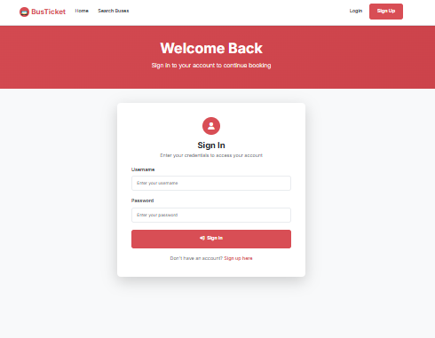

# 🚌 Bus Ticket Booking System

A modern, full-stack bus ticket booking application built with Django REST API backend and React frontend, featuring a redbus.com-inspired user interface.

## 📋 Table of Contents
- [Features](#-features)
- [Technology Stack](#-technology-stack)
- [Screenshots](#-screenshots)
- [Installation](#-installation)
- [Usage](#-usage)
- [API Endpoints](#-api-endpoints)
- [Project Structure](#-project-structure)
- [Contributing](#-contributing)
- [License](#-license)

## ✨ Features

### 🔐 Authentication & User Management
- User registration and login
- JWT token-based authentication
- User profile management
- Secure password handling

### 🚌 Bus Search & Booking
- Search buses by source, destination, and date
- Real-time seat availability
- Interactive seat selection interface
- Passenger details management
- Booking confirmation system

### 🎨 Modern UI/UX
- Redbus.com-inspired design
- Responsive layout for mobile and desktop
- Modern card-based interface
- Intuitive navigation
- Loading states and error handling

### 🔧 Admin Features
- Django admin panel
- Bus and route management
- User booking management
- Seat availability tracking

## 🛠 Technology Stack

### Backend
- **Django 5.2.4** - Web framework
- **Django REST Framework** - API development
- **SQLite** - Database (can be easily switched to PostgreSQL/MySQL)
- **JWT Authentication** - Secure user authentication
- **Django CORS Headers** - Cross-origin resource sharing

### Frontend
- **React 18** - User interface
- **React Router** - Client-side routing
- **Axios** - HTTP client
- **React Bootstrap** - UI components
- **React Icons** - Icon library

### Development Tools
- **Git** - Version control
- **GitHub** - Code hosting
- **Virtual Environment** - Python dependency management

## 📸 Screenshots

### Home Page & Search Interface

*Modern search interface with source, destination, and date selection*

### Search Results

*Bus search results with filters and booking options*

### Seat Selection

*Interactive seat map for selecting available seats*

### Booking Confirmation

*Booking confirmation with passenger and route details*

### User Authentication

*User login and registration pages*

## 🚀 Installation

### Prerequisites
- Python 3.8+
- Node.js 14+
- npm or yarn

### Backend Setup

1. **Clone the repository**
   ```bash
   git clone https://github.com/vishnudev-p/Bus-Ticket-Booking.git
   cd Bus-Ticket-Booking
   ```

2. **Navigate to backend directory**
   ```bash
   cd backend
   ```

3. **Create and activate virtual environment**
   ```bash
   # Windows
   python -m venv venv
   venv\Scripts\activate

   # macOS/Linux
   python3 -m venv venv
   source venv/bin/activate
   ```

4. **Install Python dependencies**
   ```bash
   pip install -r requirements.txt
   ```

5. **Run database migrations**
   ```bash
   python manage.py makemigrations
   python manage.py migrate
   ```

6. **Create superuser (optional)**
   ```bash
   python manage.py createsuperuser
   ```

7. **Seed sample data**
   ```bash
   python manage.py shell
   ```
   ```python
   exec(open('core/scripts/seed_south_india_data.py').read())
   exit()
   ```

8. **Start Django server**
   ```bash
   python manage.py runserver
   ```
   Backend will be running at `http://127.0.0.1:8000`

### Frontend Setup

1. **Navigate to frontend directory**
   ```bash
   cd frontend/busticket-frontend
   ```

2. **Install Node.js dependencies**
   ```bash
   npm install
   ```

3. **Start React development server**
   ```bash
   npm start
   ```
   Frontend will be running at `http://localhost:3000`

## 📖 Usage

### For Users

1. **Register/Login**
   - Visit the application
   - Create an account or login with existing credentials

2. **Search for Buses**
   - Select source and destination cities
   - Choose travel date
   - Click "Search Buses"

3. **Select Bus and Seats**
   - View available buses with details
   - Apply filters (bus type, fare, rating)
   - Click "View Seats" on preferred bus

4. **Book Seats**
   - Select available seats on the seat map
   - Enter passenger details
   - Confirm booking

5. **View Bookings**
   - Access "My Bookings" to view all reservations
   - Cancel bookings if needed

### For Administrators

1. **Access Admin Panel**
   - Go to `http://127.0.0.1:8000/admin`
   - Login with superuser credentials

2. **Manage Data**
   - Add/edit cities, bus operators, buses
   - Create routes with schedules
   - Monitor bookings and user activity

## 🔌 API Endpoints

### Authentication
- `POST /api/register/` - User registration
- `POST /api/token/` - User login
- `POST /api/token/refresh/` - Refresh JWT token

### Cities & Routes
- `GET /api/cities/` - List all cities
- `GET /api/routes/` - List all routes
- `GET /api/routes/search/` - Search routes by criteria

### Buses & Seats
- `GET /api/buses/` - List all buses
- `GET /api/seats/` - List seats (filtered by bus)
- `GET /api/seats/available_seats/` - Get available seats

### Bookings
- `GET /api/bookings/` - User's bookings
- `POST /api/bookings/` - Create new booking
- `POST /api/bookings/{id}/cancel/` - Cancel booking

## 📁 Project Structure

```
BusTicketApp/
├── backend/
│   ├── busticket/          # Django project settings
│   ├── core/              # Main Django app
│   │   ├── models.py      # Database models
│   │   ├── views.py       # API views
│   │   ├── serializers.py # Data serialization
│   │   └── scripts/       # Data seeding scripts
│   ├── manage.py          # Django management
│   └── requirements.txt   # Python dependencies
├── frontend/
│   └── busticket-frontend/
│       ├── src/
│       │   ├── components/ # React components
│       │   ├── utils/      # Utility functions
│       │   └── App.js      # Main React app
│       └── package.json    # Node.js dependencies
└── README.md
```

## 🛠 Development

### Running in Development Mode

1. **Start Backend**
   ```bash
   cd backend
   venv\Scripts\activate  # Windows
   python manage.py runserver
   ```

2. **Start Frontend**
   ```bash
   cd frontend/busticket-frontend
   npm start
   ```

3. **Access Application**
   - Frontend: `http://localhost:3000`
   - Backend API: `http://127.0.0.1:8000`
   - Admin Panel: `http://127.0.0.1:8000/admin`

### Database Management

**Reset all seats to available:**
```bash
python manage.py reset_seats
```

**Fix seat booking status:**
```bash
python manage.py fix_seats
```

## 🐛 Troubleshooting

### Common Issues

1. **ModuleNotFoundError: No module named 'django'**
   - Activate virtual environment: `venv\Scripts\activate`

2. **CORS errors in frontend**
   - Ensure backend is running on `http://127.0.0.1:8000`
   - Check CORS settings in `backend/busticket/settings.py`

3. **Seats showing as booked when they shouldn't be**
   - Run: `python manage.py reset_seats`

4. **Authentication errors**
   - Clear browser localStorage
   - Re-login to get fresh JWT tokens

## 🤝 Contributing

1. Fork the repository
2. Create a feature branch: `git checkout -b feature-name`
3. Make your changes
4. Commit your changes: `git commit -m 'Add feature'`
5. Push to the branch: `git push origin feature-name`
6. Submit a pull request

## 📝 License

This project is licensed under the MIT License - see the [LICENSE](LICENSE) file for details.

## 👨‍💻 Author

**Vishnu Dev P**
- GitHub: [@vishnudev-p](https://github.com/vishnudev-p)
- Project: [Bus Ticket Booking System](https://github.com/vishnudev-p/Bus-Ticket-Booking)

## 🙏 Acknowledgments

- Django REST Framework for robust API development
- React Bootstrap for beautiful UI components
- Redbus.com for UI/UX inspiration
- Open source community for various libraries and tools

---

⭐ **Star this repository if you found it helpful!**
